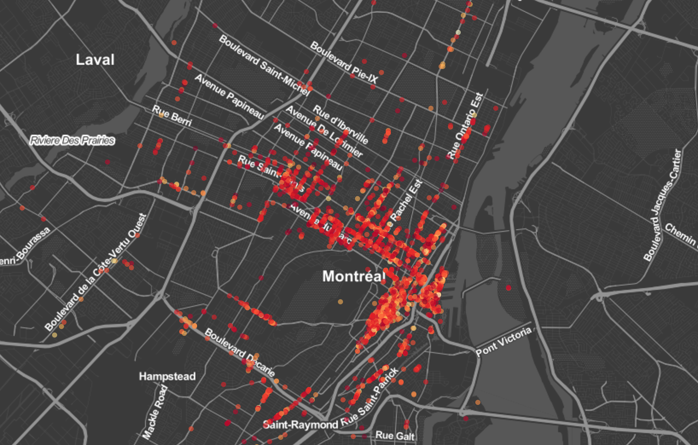
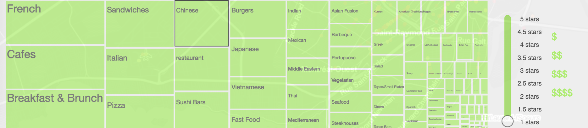
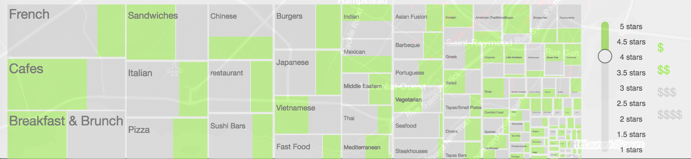
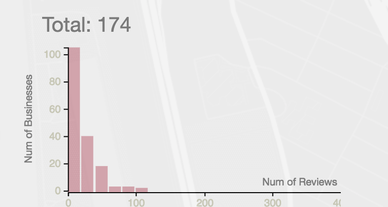
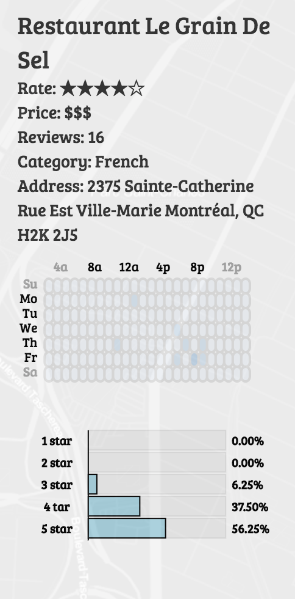
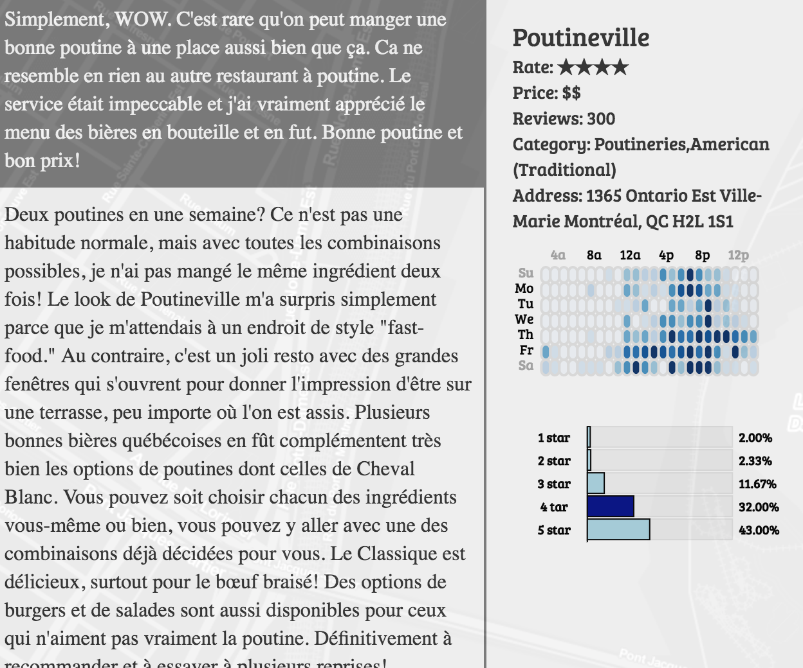
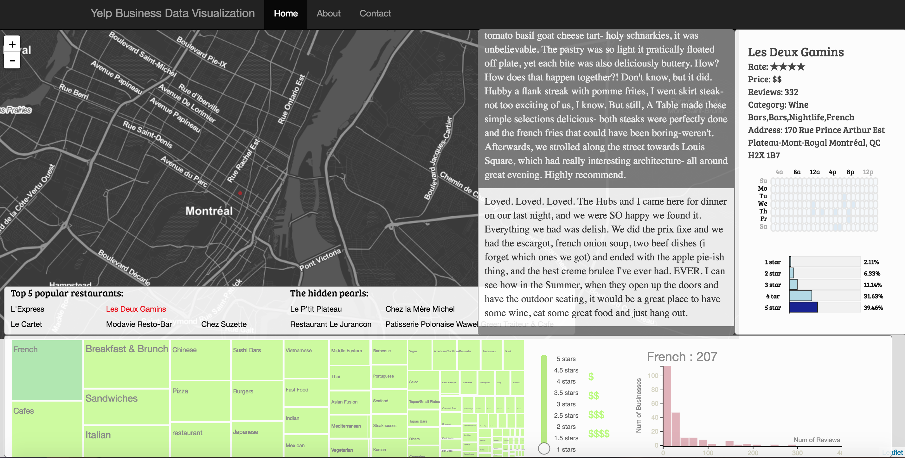

Final Project - Yelp Dataset Visualization  
===

[Project Link]( https://yihaozhou.github.io/Data-Visualization-Final-Project/)

###team
Hongzhang Cheng (hcheng3)
Yihao Zhou (iihaw)
Shi Wang (stels07)

-
In this project, we visualized restaurants data in Montreal. We want to provide a better user experience for selecting restaurants.

### map functions

We first put all restaurants data on map of montreal. The color of the circles is mapped to average rating of the restaurant. User is able to drag and zoom the map. The treemap and histogram on the bottom will be updated on map reset, and they are coordinated with the number of restaurants within the screen. We add this feature because location is often an important factor when picking restaurants. People are interested to know what is around. 

### treemap

The bottom panel offers the filter functions. We use a treemap to filter category. The size of the treemap leaves are mapped to the number of restaurants that have this category label. The benefit of this design is that it is a filter but at the same time, user is able to have a bigger picture of the distribution of the businesses. Click an element in the treemap will filter restaurants on the map, and the histogram will update accordingly. User will also see a suggestion board, which lists the most popular restaurants within the filtered data. The suggestion board gives developer an opportunity to apply recommendation algorithms. For example, we can suggest newly opened restaurants with high ratings but fewer reviews.

### price and rating filters
The price and star rating filter coordinate with the treemap, histogram and map. When we interact with these two filters, the size of the green rectangles and the circles on the map will change accordingly, so does the histogram. The multiple choice price button works similarly.The green rectangles in the treemap means restaurants satisfy the filter and the grey rectangles are the ones that do not. With the help of these two filter and treemap, we could know the price and star distribution of the restaurants in one category which could give user a general information of restaurants in this area.There are 3 filters here, category, price and average rating. We design it in a way that either one can be the primary filter. 

###historgram

The histogram on the bottom left shows a distribution of number of restaurants over number of reviews. Number of reviews of a certain restaurant is a strong indicator of how average rating reflects the reality. The histogram also acts as a 4th filter. Clicking on a bar will select restaurants that have larger number of reviews than a certain number, and the map will be updated

###business info

When you click on a restaurant in the map, it will bring up a panel from the right side of the screen showing the detail information about this restaurant, including name, rating stars, price range, address, and categories. This is the checkin heatmap.  It shows the number of checkins in a week. Each rectangle represents number of checkins in a hour. We can see what time in a day and what day in a week this restaurant is busy so we can maybe avoid the peak hour. We implemented a rating distribution barchart. It shows the percentage of reviews in each rating level. When you click on the bar it will bring up a second panel listing all the reviews in this rating. When finish reading, you can simply click on the review panel to hide the review. Or you can click on the map to hide both review and detail info panel.

###final design

This is our final design and all the interaction part were described in the previous sections.

###references
https://bost.ocks.org/mike/leaflet/

http://flowingdata.com/2014/07/02/jobs-charted-by-state-and-salary/

http://bl.ocks.org/dukevis/6768900

